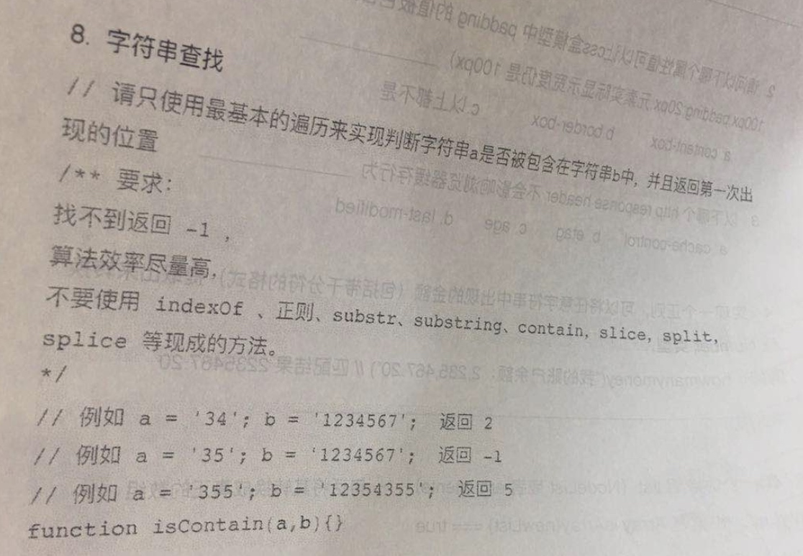

# 字符串查找


不能用现成的API。。
```
function includes(str1, str2) {
    let len = str1.length;
for (let i = 0; i <= str2.length - len; i++) {  // 0~3
        let count = 0;
        for (let j = 0; j < str1.length; j++) {  // 0~2
            if (str1[j] === str2[i + j]) {
                count++
            }
        }
        if (count === len) { 
            return i
        }
    }
    return -1;
}

var res = includes("34","12345");
console.log(res);
```