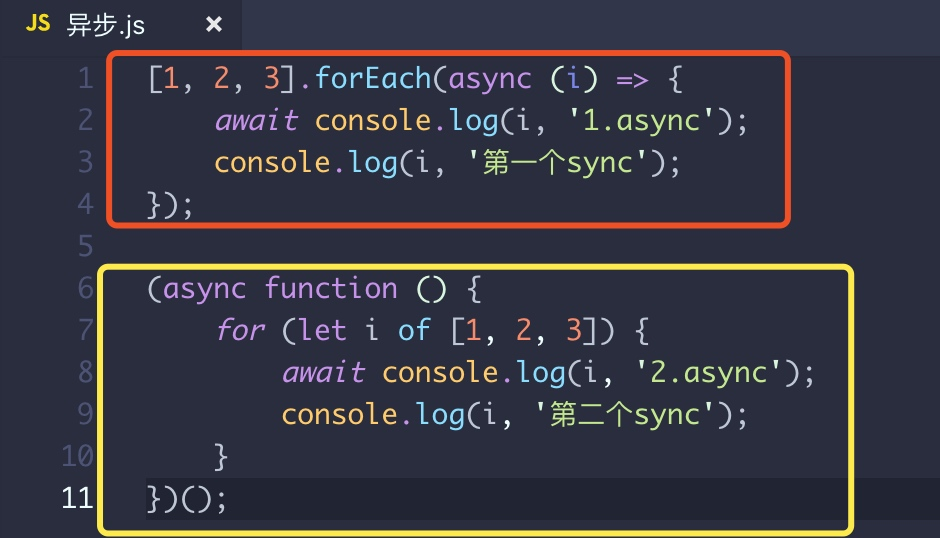

# async

对比它们的区别，感受async的用法：

```
[1, 2, 3].forEach(async (i) => {
    await console.log(i, '1.async');
    console.log(i, '第一个sync');
});

(async function () {
    for (let i of [1, 2, 3]) {
        await console.log(i, '2.async');
        console.log(i, '第二个sync');
    }
})();
```