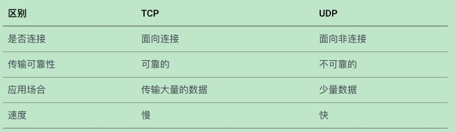
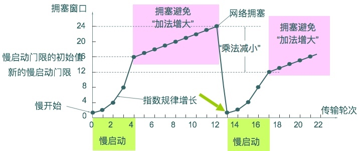

# TCP & UDP
### 一、区别

### 二、TCP的机制

> 当 拥塞窗口 < 阈值 时，使用慢启动算法
> 当 拥塞窗口 > 阈值 时，使用拥塞避免算法
> 当 拥塞窗口 ＝ 阈值时，既可以使用慢启动算法，也可时使用拥塞避免算法。

随着网络拥塞的出现和变化，阈值也会不断变化。TCP拥塞控制中，阈值的初始值为16

> 快恢复的时候不执行慢启动，只是把ssthresh设置为当时的一半，然后从这个新值开始执行拥塞避免，