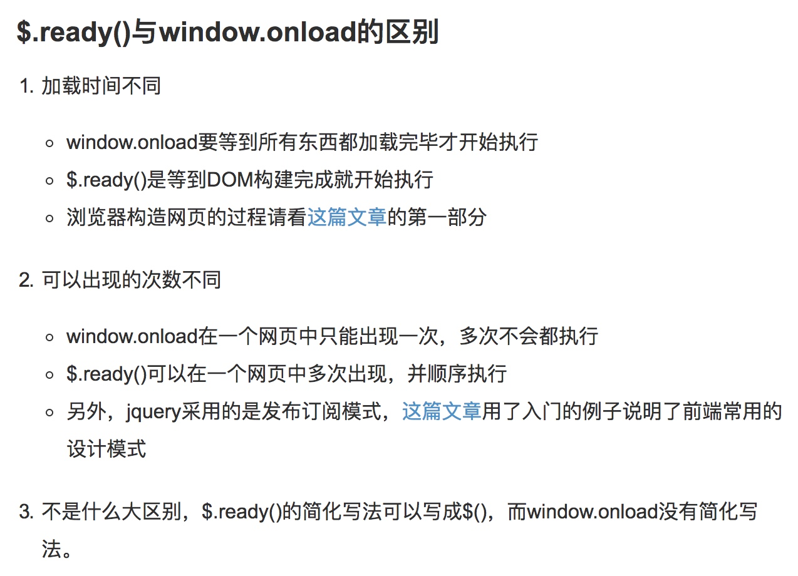
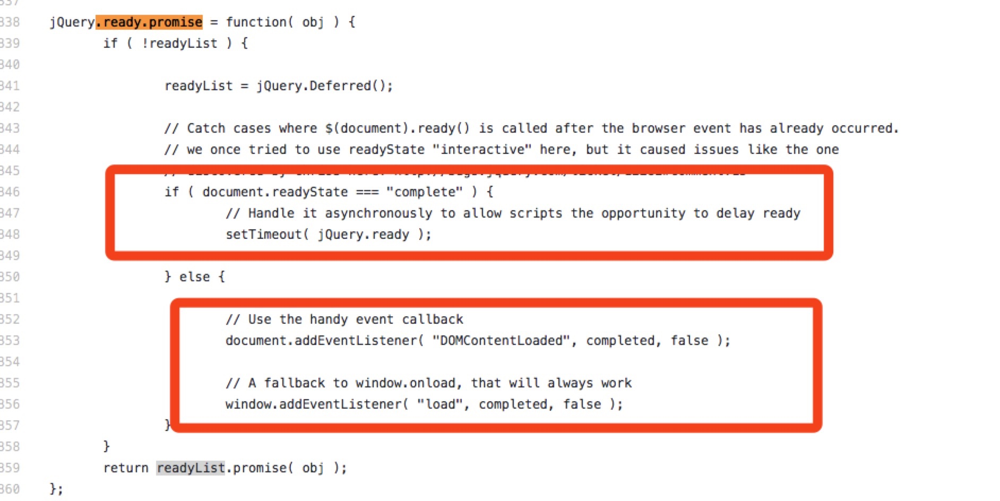

# 美团一面-电面-0907 

## html
- 语义化标签有哪些?常用的?头部的?用语义化标签有什么好处? 
header、section、footer、nav、aside、h1~h6
好处：有利于seo；方便维护
- meta标签中有哪些属性?(引导，比如能提高seo访问量的)
- 引入css和js文件方法有哪些
     script、link、 @import
    
## css
- 引入css样式的方式
    内联样式、DOM控制、@import
    
- 动画的属性有哪些?
- animation实现动画旋转360度;
- 行内元素、块级元素;
- position有哪些?
- fixed和absolute是相对于谁定位的?
- 有哪些单位?和rem最相近的是哪个? rem怎么设置的?(回答:1rem=16px; 面试官引导，把它写在哪个标签里) 
- inline、inline-block和block的区别?
- 块级元素哪些?行内元素哪些? 
- 直角三角形(昨天的选择题题目中有)怎么实现的?(昨天选的是C) 
- 水平垂直居中?

## js
- 怎么实现ajax传输?
- jsonp解决跨域问题，回调函数怎么执行的? 
- 怎么判断页面是否加载完成?
- jq的ready用过吗?ready怎么实现的 ?
灵魂三连问

>     $.ready()的作用
>     $.ready()与window.onload的区别是什么？
>     $.ready()的实现原理是什么？
 
 
######   $.ready()的实现原理是什么？


先用`documnet.readyState==="complete"`判断页面DOM是不是已经渲染完毕。如果还没有，就监听`DOMContentLoaded`和`load`事件。优先用`DOMContentLoaded`来实现dom数渲染完成后加载资源，而不是等所有的资源加载完之后加载js文件等资源。

-------

- 页面存储方式有哪些?
- cookie和session的区别
- cookie和localSrorage的区别

> cookie：4k；http头部自动包括cookie信息；可以设置最大有效期；安全性低；
> session：服务器端；安全性高；
> localStorage：5M,手动清除
> sessionStorage：5M。关闭浏览器后失效
> IndexDB：无线；手动清楚

-------

- 箭头函数的特点

-------

- ES6中数组常用的api? 

   ` map()`（数组去重），`find()`（找到符合条件的值）,`fill()`(填充数组)，遍历器：`key()`,`values()`和`entries`
- 怎么判断对象类型?(不止三种方法。。但我只知道三种)

- 简单说下原型链? call和apply的区别?作用?(改变this的指向)?
- 其他改变this指向的方法 bind和call的区别?(bind返回一个函数。)面试官:不够具体，太抽象了。。。 
- 了解哪些es6的语法?Class用过吗?
- 谈谈变量提升?
- 举例几种情况，要求说出结果:

```
function f(){
/Users/greta/Desktop/ES6复习重点    console.log(a);
var a =1; 
    
}

function f(){
    let a =1;
    console.log(a);  // 答案：报错
}

function f(){

}
f(1,3);
// 􏰉􏰊􏰋􏰌f􏰍.length􏰄􏰅􏰆􏰇􏰈􏰅􏰆􏰇是多少? 答案:0
```
