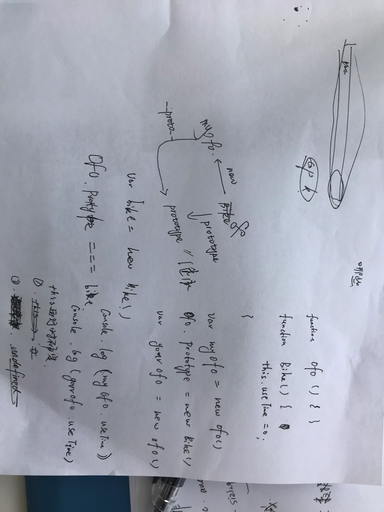

# 酷家乐初面 09.20 
现场面

自我介绍提到研究方向

### 1. 说一下RNN或者LSTM的原理（面试官一时兴起问的，不算在考核评价内）
### 2. ES6的async await
### 3. 算法题：*在长度为m的数组中找第K大的值*
先排序再找

***什么排序？***

快排，时间复杂度低

***时间复杂度是多少？***

nlog2^n

***你说了平均时间复杂度，那最坏情况下呢***
我说我不记得了。但是我可以把它理解成一颗二叉树，当这个序列是有序的，那就是最坏情况。每个数字都是一个节点，计算这颗树的深度，就是递归的次数，就可以得到最坏情况的时间复杂度了。

（面试官说有点想得太复杂了)

***稳定不稳定？***

（推一遍，在草稿纸上画了一下，走了一下排序流程）但是还是讲不清楚。。

***什么是稳定？***

我的理解是，如果原本数组中两个相等的数字，那排序结束后，他们没有交换位置，就说明是稳定的排序。面试官说这个理解是对的，就给我时间继续琢磨

***能不能用伪代码写一下快排流程？***

用js写了，给面试官看

***现在已经把排序捋清楚了，你觉得还有什么能够优化的地方吗？***
想了一会儿，有一点点想法，但是不敢说。
面试官给了一点提示。
既然左边和右边已经确定比中间的数要小和大，那其实比较一下`K`和`arr.length`就可以了。
比如在长度为8的数组找第3大的数，第一趟快排之后，在左边那堆找就可以了。可以减少比较次数。

### 4.用过box-sizing吗？
没有。

### 5.闭包怎么理解？

### 6.写输入输出

**两个知识点：**
this指向问题
原型链问题

### 7.跨域
讲了一下AJAX跨域的解决方式和原理。
> （现在面试的时候，讲太多，面试官反而怀疑我们是背的。。。索性只讲自己用过的。他不问我iframe、cookie，我就不主动说了）

### 8.用过vue吗？
没有
