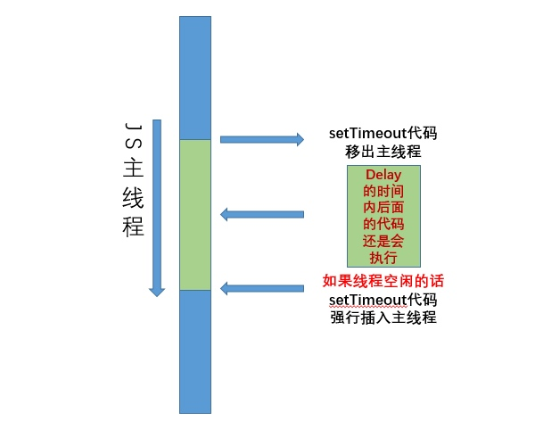

# setTimeOut  setInterval和requestAnimationFrame三者之间的问题

### 一、setTimeOut ()
settimeout只运行一次，也就是说设定的时间到后就触发运行指定代码，运行完后即结束。
如果运行的代码中再次运行同样的settimeout命令，则可循环运行。
##### 怎么取消
`clearTimeout`

##### 作用域
this指向window。因为它是异步的

##### setTimeOut()方法时间不准确的原因

图里面**红色**字——“如果线程空闲的话”！
因为如果js主线程不空闲，`setTimeout()`代码是没有办法在Delay的时间后按时执行的。

###  二、setInterval()
setinterval是循环运行的，即每到设定时间间隔就触发指定代码。这是真正的定时器。

##### 怎么取消
`clearInterval()`

##### 作用域
同setTimeOut

**比较：**setinterval使用简单，而settimeout则比较灵活，可以随时退出循环，而且可以设置为按不固定的时间间隔来运行，比如第一次1秒，第二次2秒，第三次3秒……

### 三、requestAnimationFrame
**做动画专用**
1. 时间间隔更稳定，requestAnimationFrame注册的回调函数最高执行频率是60FPS。
2. 它注册的回调函数与浏览器的渲染同步。

##### 作用域
一样的。。。this还是指向调用它的对象window

##### 应用举例

```
var fadeOut = function(dom){
    //此处初始化节点属性
    dom.style.opacity = 1;
    dom.style.display = 'block';
    //这是一个淡出的步骤
    //在这个方法中我们用requestAnimationFrame来反复调用此函数,来执行动画
    
    var fade = (function(){
        var val = parseFloat(dom.style.opacity);
        if ((val -=.1)<0){
            dom.style.display = 'none';
        }else{
            dom.style.opacity = val;
            requsetAnimationFrame(fade);
        }
    })();
};
```

##### 与setTimeout()的区别
区别是 setTimeout 是用户指定的，而 requestAnimationFrame 是浏览器刷新频率决定的，一般遵循 W3C 标准，它在浏览器每次刷新页面之前执行。

但是对DOM操作频繁。（当然了，浏览器刷新重绘一次的时间是16.67s，所以requestAnimationFrame的刷新频率也是每16.67s就刷新一次）。

每天的理解都越来越进一步了……

9.25补充：
>setTimeOut是异步的，也就是说它在任务队列中，要等待执行队列中的同步任务完成以后，才会被执行，如果同步任务一直没有结束，超过它设定的时间了，就会造成线程阻塞。
>原本延迟1s执行的任务，可能就要1.2s才能被执行了。
>但是requestAnimationFrame是完全依赖物理特性的，和浏览器的刷新频率一致。

### 四、三者作用域的问题怎么解决

call、apply、bind

###### 拓展——常见面试题：说说以上三者的区别

> call、apply都是改变this指向，立即在指定的 this 环境下执行函数，只是参数指定的方式不一样
> 而bind()会返回一个参数，会一直把this绑定在指定作用域上，以后每次调用时都会都会使用这个作用域。