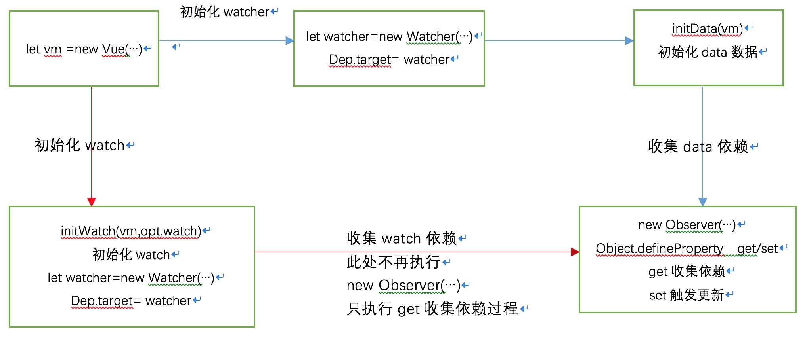

# watch钩子函数
Vue中的watch机制就是，可以在修改数据的时候出发一个回调。
Vue中的数据的所有属性都被加上了getter和setter。
Watcher对象在需要数据绑定的时候初始化，之后这个Watch对象被放入需要观察的属性的Dep队列中。当对象的这个属性被赋值或者修改时，setter就会通知deps中的Watcher，然后Watcher负责调用回调。

这张图暂时还看不懂。放在这里，如果有懂的人，希望issue中给出一点关键性的思路。