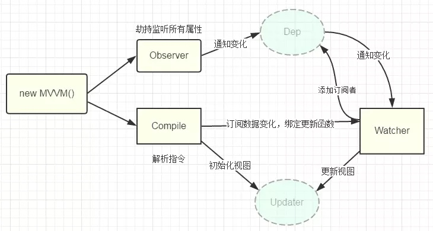

# 双向绑定原理
就是一个监听器+一个观察者
>  1、实现一个数据监听器Observer，能够对数据对象的所有属性进行监听，如有变动可拿到最新值并通知订阅者 
>  2、实现一个指令解析器Compile，对每个元素节点的指令进行扫描和解析，根据指令模板替换数据，以及绑定相应的更新函数
>  3、实现一个Watcher，作为连接Observer和Compile的桥梁，能够订阅并收到每个属性变动的通知，执行指令绑定的相应回调函数，从而更新视图

### 1、实现监听器：
遍历每个需要监听的数据对象，包括子属性对象的属性，利用defineProperty()方法给它们绑定set()和get()方法。这样一旦对这些属性进行赋值或者更改，就能监听到数据的变化。

#### 监听到变化后怎么通知订阅者？
维护一个数组，用来收集订阅者。定义两个方法，数组变化了，就触发notify方法，再调用订阅者的update()方法；

### 2、实现Compile
compile主要做的事情是解析模板指令，将模板中的变量替换成数据，然后初始化渲染页面视图，并将每个指令对应的节点绑定更新函数，添加监听数据的订阅者，一旦数据有变动，收到通知，更新视图

### 3、实现Watcher观察者
Watcher订阅者作为Observer和Compile之间通信的桥梁，主要做的事情是: 1、在自身实例化时往属性订阅器(dep)里面添加自己 2、自身必须有一个update()方法 3、待属性变动dep.notice()通知时，能调用自身的update()方法，并触发Compile中绑定的回调，则功成身退。

## 梳理：
首先我们为每个vue属性用Object.defineProperty()实现数据劫持，为每个属性分配一个订阅者集合的管理数组dep；然后在编译的时候在该属性的订阅队列（维护一个数组）dep中添加订阅者，v-model会添加一个订阅者，{{}}也会，v-bind也会，只要用到该属性的指令理论上都会，接着为input添加监听事件，修改值就会为该属性赋值，触发该属性的set方法，在set方法内通知订阅者数组dep，订阅者数组循环调用各订阅者的update方法来更新视图。