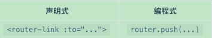

# 路由
### 一、用法：
定义路由组件routes
每个路由应该映射到一个组件

新建一个路由router，然后传入‘routes’配置

创建和挂载实例。把router的配置注入vm，让整个应用都有路由功能。

### 二类型
#### 动态路由配置

往routers传入’routes‘配置时，在路径参数使用“：”冒号标记

每当匹配到一个路由时，参数值会被设置到route.params中，可以在每个组件内使用。


[动态路由设置-文章参考](https://router.vuejs.org/zh/guide/essentials/dynamic-matching.html)

#### 嵌套路由
就是在原路由的基础上加了一个`children`，是一个数组。

在user组件的模板里用`route.params.id``
```
const User = {
  template: `<div class="user">
              <h2>User {{ $route.params.id }}</h2>
              <router-view></router-view>
         </div>
              `
}
```

router的配置如下:
```
const router = new VueRouter({
  routes: [
    { path: '/user/:id', component: User,
      children: [
        {
          // 当 /user/:id/profile 匹配成功，
          // UserProfile 会被渲染在 User 的 <router-view> 中
          path: 'profile',
          component: UserProfile
        },
        {
          // 当 /user/:id/posts 匹配成功
          // UserPosts 会被渲染在 User 的 <router-view> 中
          path: 'posts',
          component: UserPosts
        }
      ]
    }
  ]
})

```


-------

#### 编程式路由
想要导航到不同的路由，可以调用router.push 。
这个方法会向 ***history 栈*** 添加一个新的记录，所以，当用户点击浏览器后退按钮时，则回到之前的 URL。


###### 声明式：


###### 编程式：
` router.push("foo")`

除了字符串路径，也可以写对象、命名的路由，甚至带查询参数

### 路由的实现原理
监听URL的变化，然后匹配路由规则，显示相应的页面，并且无需刷新。
目前单页面使用的路由实现方式就两种：


* hash模式


* Histore模式

