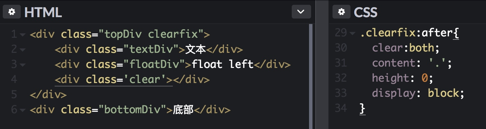

# 清除浮动的方法

[清除浮动的原理](https://codepen.io/singsingasong/pen/GXejMP?editors=1100)

## 方案一：`clear:both`

在包含浮动元素的父级div内，在所有div的后面加入一个没有内容的_**块级**_ 元素\(必须是块级）。

### 原理：

告诉浏览器，我的左右两边都要清除浮动。但是因为浮动元素的位置已经确定了，所以为了满足div.clear的需求，浏览器只能把div.clear渲染在浮动元素的下面，最后_**父级元素的高度也被撑开**_了。（因为div.clear是在正常的文档流中的，它肯定还是要待在父级元素里面，所以父级元素想要包含它，只能增加自己的高度）

## 方案二：`：after`伪元素

原理同上，只不过是生成空白div的方式不同而已； 

## 方案三：`overflow`

原理：BFC块格式化上下文 让父元素`overflow:hidden|auto`

