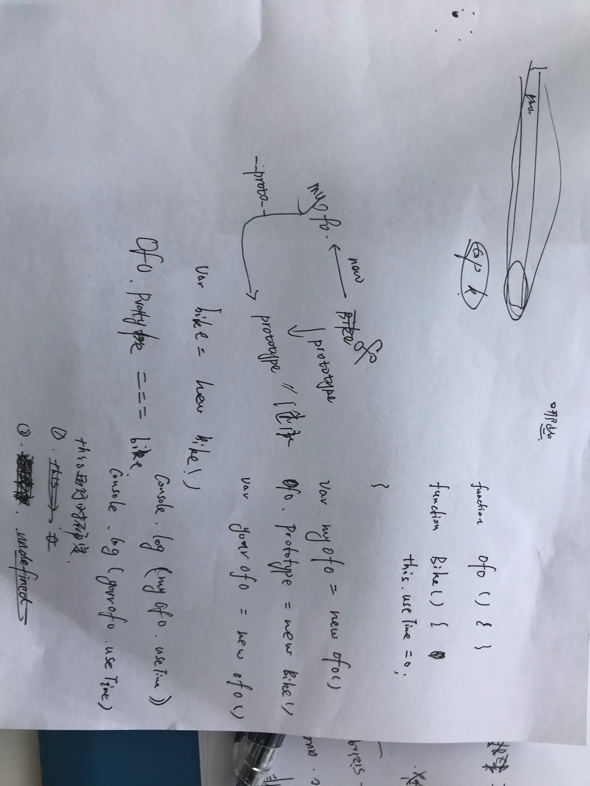

# 酷家乐初面

现场面

自我介绍提到研究方向

## 1. 说一下RNN或者LSTM的原理（面试官一时兴起问的，不算在考核评价内）

## 2. ES6的async await

## 3. 算法题：_在长度为m的数组中找第K大的值_

先排序再找

_**什么排序？**_

快排，时间复杂度低

_**时间复杂度是多少？**_

nlog2^n

_**你说了平均时间复杂度，那最坏情况下呢**_ 我说我不记得了。但是我可以把它理解成一颗二叉树，当这个序列是有序的，那就是最坏情况。每个数字都是一个节点，计算这颗树的深度，就是递归的次数，就可以得到最坏情况的时间复杂度了。

（面试官说有点想得太复杂了\)

_**稳定不稳定？**_

（推一遍，在草稿纸上画了一下，走了一下排序流程）但是还是讲不清楚。。

_**什么是稳定？**_

我的理解是，如果原本数组中两个相等的数字，那排序结束后，他们没有交换位置，就说明是稳定的排序。面试官说这个理解是对的，就给我时间继续琢磨

_**能不能用伪代码写一下快排流程？**_

用js写了，给面试官看

_**现在已经把排序捋清楚了，你觉得还有什么能够优化的地方吗？**_ 想了一会儿，有一点点想法，但是不敢说。 面试官给了一点提示。 既然左边和右边已经确定比中间的数要小和大，那其实比较一下`K`和`arr.length`就可以了。 比如在长度为8的数组找第3大的数，第一趟快排之后，在左边那堆找就可以了。可以减少比较次数。

## 4.用过box-sizing吗？

没有。

## 5.闭包怎么理解？

## 6.写输入输出

 **两个知识点：** this指向问题 原型链问题

## 7.跨域

讲了一下AJAX跨域的解决方式和原理。

> （现在面试的时候，讲太多，面试官反而怀疑我们是背的。。。索性只讲自己用过的。他不问我iframe、cookie，我就不主动说了）

## 8.用过vue吗？

没有

