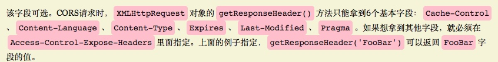

# CORS跨域

> 跨域是浏览器的安全策略，是为了控制js不操作不同域的数据

Cross-Origin resource sharing

## 1.需要服务器和浏览器同时支持

## 2.CORS通信与同源的Ajax通信代码一样

## 3.实现的关键：服务器

## 4.简单请求：

* 在头信息中，加`Origin`字段
* `Origin`字段作用：说明请求来自哪个源（端口+协议+域名）
* 服务器根据👆，决定是否同意这个请求

### 不同意：返回正常的HTTP响应

```text
浏览器在头字段中没找到`Access-Control-Allow-Origin`字段，抛出错误，由`XMLHttpRequest`的`onerror`回调函数捕获。
```

### 同意：多几个头信息字段。

`Access-Control-Allow-Origin`\(必选）: 接受任意域名的请求

`Access-Control-Allow-Credentials`\(可选，布尔值）: 是否允许发送cookie

`Access-Control-Expose-Headers`\(可选\): 

## 5.发送cookie：

**服务器:** 设置`Access-Control-Allow-Credentials:true`

**前端：** 在Ajax中

```text
// 允许跨域
crossDomain: true,
// 下面这句话允许跨域的cookie访问
xhrFields: {
    withCredentials: true // 带本地的一些cookie信息
}
```

