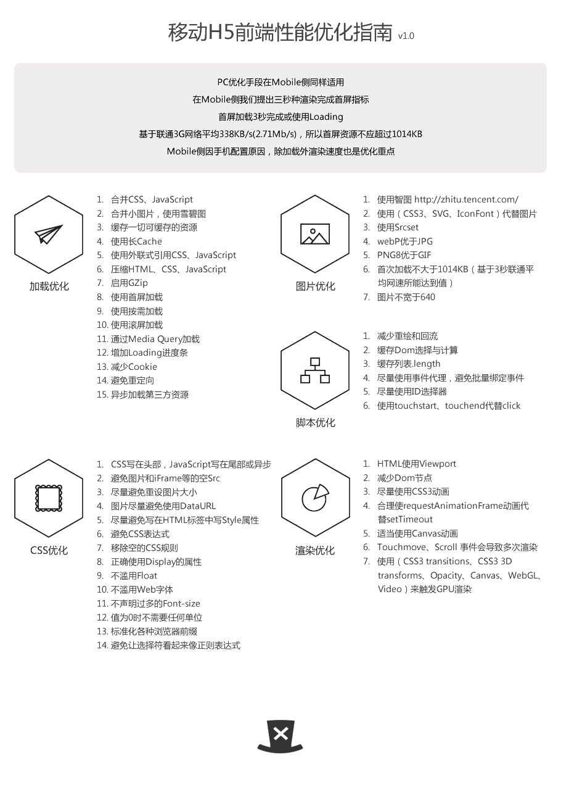

# 性能优化

### 一、加载优化
#### http
首次加载的时候，减少HTTP请求数量。合并css、js；小图片合并雪碧图；
#### 缓存
静态资源尽量缓存；
用外联形式引用CSS,JS
#### 压缩
压缩html,css,js，多余的空格、缩进和换行符
#### loading
预加载的时候放一个loading动画（但是不好太长，最好控制在3s）
#### 按需加载

###二、 渲染优化
#### 减少DOM节点和DOM操作
#### 动画优化
用requestAnimationFrame代替setTImeout
尽量用CSS，少用JS

#### 三、脚本优化
CSS写在头部
JS写在尾部或者异步

#### 四、css优化
避免图片和iFrame等的空src

#### 五、渲染优化

