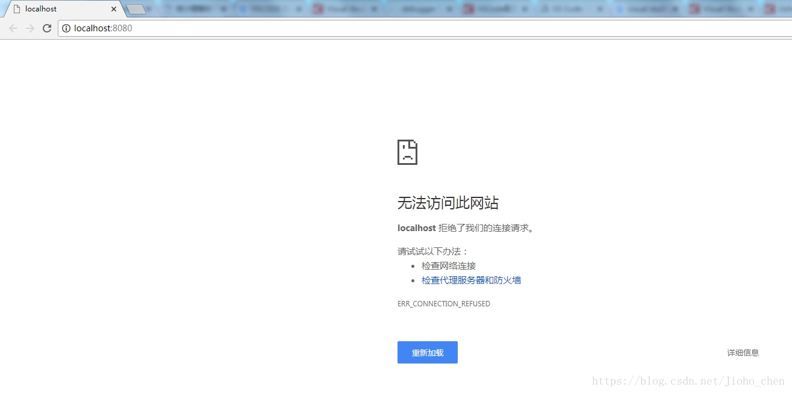
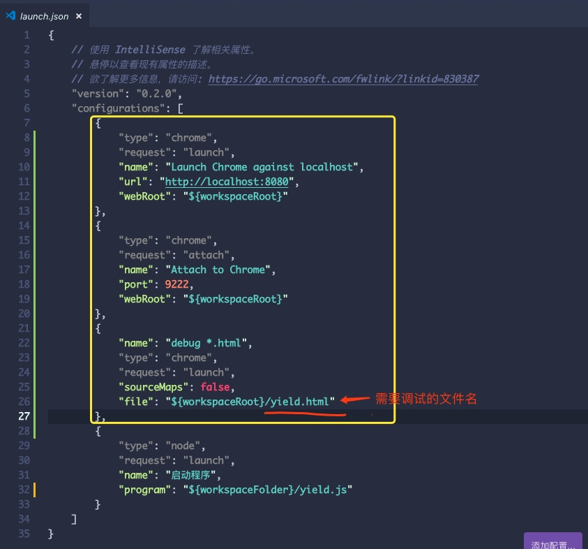

# Debugger for Chrome
### 问题描述：




### 解决方式：

#### 代码：
在 `launch.json`文件中设置：

```
{
    // 使用 IntelliSense 了解相关属性。 
    // 悬停以查看现有属性的描述。
    // 欲了解更多信息，请访问: https://go.microsoft.com/fwlink/?linkid=830387
    "version": "0.2.0",
    "configurations": [
        {
            "type": "chrome",
            "request": "launch",
            "name": "Launch Chrome against localhost",
            "url": "http://localhost:8080",
            "webRoot": "${workspaceRoot}"
        },
        {
            "type": "chrome",
            "request": "attach",
            "name": "Attach to Chrome",
            "port": 9222,
            "webRoot": "${workspaceRoot}"
        },
        {
            "name": "debug *.html",
            "type": "chrome",
            "request": "launch",
            "sourceMaps": false,
            "file": "${workspaceRoot}/yield.html"
        },
        {
            "type": "node",
            "request": "launch",
            "name": "启动程序",
            "program": "${workspaceFolder}/yield.js"
        }
    ]
}
```